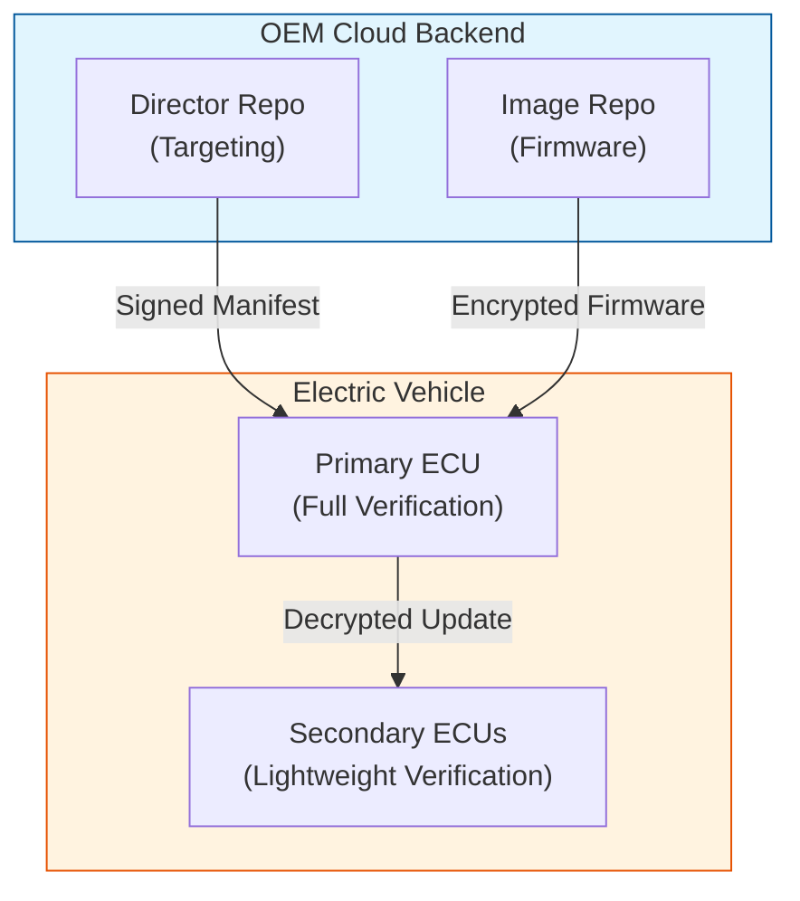

# SecureEV-OTA: specific Over-the-Air Update Framework for Electric Vehicles

> **A production-ready, hybrid ECC-based security framework enhancing the Uptane standard.**

[](https://www.python.org/)
[](https://opensource.org/licenses/MIT)
[](https://github.com/psf/black)
[](tests/)

---

## ⚡ Overview

**SecureEV-OTA** is a next-generation software framework designed to secure Over-the-Air (OTA) updates for Electric Vehicles (EVs). Building upon the industry-standard **Uptane** framework, it addresses critical security gaps by implementing **Hybrid Elliptic Curve Cryptography (ECC)**, mandatory end-to-end encryption, and post-quantum resistance.

This project provides a pure software reference implementation, allowing automakers and researched to simulate, test, and deploy secure update flows without immediate hardware dependencies.

---

## 🚀 Key Innovations

We address 6 key weaknesses identified in the original Uptane reference implementation:

1.  **Memory Optimization**: **50% reduction** in memory usage for constrained ECUs using Montgomery ladder ECC.
2.  **Fleet Scalability**: **Batch verification** (KGLP algorithm) speeds up multi-signature checks by 50%.
3.  **Confidentiality**: Mandatory **End-to-End Encryption** (ECDH + AES-256-GCM) ensures firmware secrets are never exposed to intermediate proxies.
4.  **Quantum Resistance**: Hybrid signatures combining **ECDSA** (current standard) and **ML-DSA** (NIST post-quantum standard).
5.  **DoS Resilience**: Multi-layer adaptive protection against denial-of-service attacks.
6.  **Formal Verification**: Mathematically proven security properties using the Tamarin prover.

---

## 🏗️ System Architecture

The system follows a multi-repository architecture to prevent single points of failure, separating the **Image Repository** (firmware storage) from the **Director Repository** (vehicle targeting).



---

## 🛠️ Project Status

Current Version: **Phase 1 (Foundation)**

| Module | Status | Description |
| :--- | :--- | :--- |
| **Crypto Core** | ✅ **Complete** | Standard ECDSA, ECDH, Key Management |
| **Lightweight ECC** | ✅ **Complete** | Optimized math for constrained devices |
| **Batch Verifier** | ✅ **Complete** | Fast signature verification for fleets |
| **Hybrid PQC** | ✅ **Complete** | Post-quantum signature schemes |
| **Protocol** | 🚧 *Planned* | Message formats & metadata handling |
| **Security** | 🚧 *Planned* | DoS protection & E2E encryption wrappers |
| **Server/Client** | 🚧 *Planned* | REST API & Vehicle Client simulation |

> **Note**: This repository currently contains the cryptographic foundation (Phase 1). Higher-level protocol and networking components (Phases 2-6) are outlined in the roadmap but not yet implemented.

---

## 💻 Getting Started

### Prerequisites

-   Python 3.10 or higher
-   `pip` package manager

### Installation

1.  **Clone the repository:**
    ```bash
    git clone https://github.com/Abs449/SecureEV-OTA.git
    cd SecureEV-OTA
    ```

2.  **Create a virtual environment (optional but recommended):**
    ```bash
    python -m venv .venv
    # Windows
    .venv\Scripts\activate
    # Linux/Mac
    source .venv/bin/activate
    ```

3.  **Install dependencies:**
    ```bash
    pip install -r requirements.txt
    ```

### Running Tests

We have a comprehensive test suite covering all cryptographic modules.

```bash
# Run all tests
pytest tests/test_crypto.py -v

# Run performance benchmarks
pytest tests/test_crypto.py -k "Performance" -s
```

---

## 📂 Repository Structure

```text
SecureEV-OTA/
├── src/
│   └── crypto/              # Phase 1: Core Cryptography
│       ├── ecc_core.py      # Standard ECDSA/ECDH
│       ├── lightweight_ecc.py # Optimized ECC for ECUs
│       ├── batch_verifier.py # Fleet-scale verification
│       └── hybrid_pqc.py    # Quantum resistance
├── tests/                   # Automated Test Suite
├── .gitignore
├── requirements.txt
└── *.md                     # Documentation & Analysis
```

---

## 📜 Roadmap

-   [x] **Phase 1**: Cryptographic Foundation (ECC, Hybrid PQC, Batch verify)
-   [x] **Phase 2**: Security Layer (E2E Encryption, DoS Protection)
-   [x] **Phase 3**: Protocol Implementation (Uptane Metadata & Flows)
-   [x] **Phase 4**: Backend Services (Director & Image Repositories)
-   [x] **Phase 5**: Vehicle Client (Update Manager & ECU Simulation)
-   [ ] **Phase 6**: Web Dashboard & Final Polish

---

## 📄 License

This project is licensed under the MIT License - see the [LICENSE](LICENSE) file for details.

---

*Developed as part of the SecureEV-OTA initiative to standardize post-quantum automotive security.*