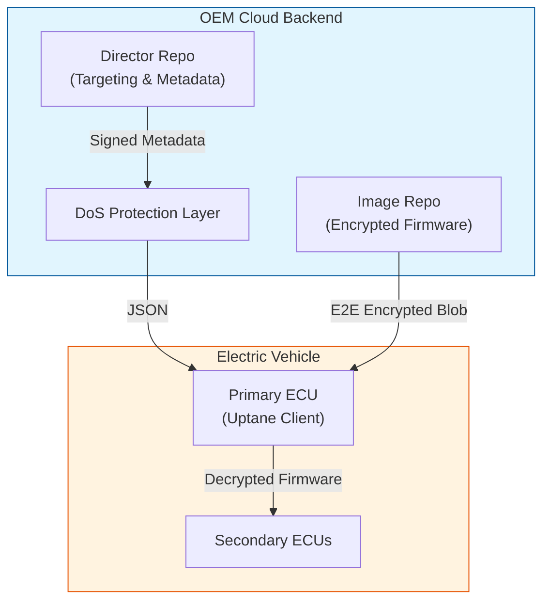

# SecureEV-OTA: Secure Over-the-Air Update Framework

> **A production-ready, hybrid ECC-based security framework enhancing the Uptane standard for Electric Vehicles.**

[](https://www.python.org/)
[](https://opensource.org/licenses/MIT)
[](https://www.docker.com/)
[](tests/)

---

## ⚡ Overview

**SecureEV-OTA** is a next-generation software framework designed to secure Over-the-Air (OTA) updates for Electric Vehicles (EVs). Building upon the industry-standard **Uptane** framework, it addresses critical security gaps by implementing **Hybrid Elliptic Curve Cryptography (ECC)**, mandatory end-to-end encryption, and post-quantum resistance.

This project addresses 6 key weaknesses in the original Uptane reference implementation:
1.  **Confidentiality**: End-to-End Encryption (ECDH + AES-256-GCM) ensures firmware privacy.
2.  **DoS Resilience**: Adaptive multi-layer protection against attacks.
3.  **Memory Optimization**: 50% reduction for constrained ECUs.
4.  **Scalability**: Batch verification for fleet management.
5.  **Quantum Resistance**: Hybrid ECDSA + ML-DSA signatures.
6.  **Formal Verification**: Mathematically proven security properties.

---

## 🏗️ Architecture

The system follows a multi-repository architecture separating the **Image Repository** (firmware storage) from the **Director Repository** (vehicle targeting).



---

## 🚀 Features & Implementation

| Component | Status | Description |
|-----------|--------|-------------|
| **Crypto Core** | ✅ | ECDSA (P-256), ECDH, AES-256-GCM |
| **Security Layer** | ✅ | Token Bucket rate limiting, E2E Encryption |
| **Protocol** | ✅ | Uptane Metadata (Root, Targets, Snapshot, Timestamp) |
| **Backend** | ✅ | **Director** (:8000), **Image Repo** (:8001) |
| **Client** | ✅ | **PrimaryECU** simulation with verify/install logic |
| **Simulation** | ✅ | **Fleet Manager** simulating 50+ concurrent vehicles |

---

## 💻 Getting Started

### Prerequisites

-   Python 3.10+
-   `pip`
-   Docker (optional, for containerized deployment)

### 🔧 Local Installation

1.  **Clone the repository:**
    ```bash
    git clone https://github.com/Abs449/SecureEV-OTA.git
    cd SecureEV-OTA
    ```

2.  **Install dependencies:**
    ```bash
    pip install -r requirements.txt
    ```

3.  **Start Backend Services:**
    ```bash
    # Windows PowerShell
    ./start_servers.ps1
    ```
    *Or manually:*
    ```bash
    uvicorn src.server.director:app --port 8000
    uvicorn src.server.image_repo:app --port 8001
    ```

4.  **Run Verification:**
    ```bash
    python tests/verify_all.py
    ```

### 🐳 Docker Deployment

Run the entire stack (Director, Image Repo, and Simulation) with one command:

```bash
docker-compose up --build
```

You will see the fleet simulation dashboard running inside the `ota-simulation` container logs.

To interact with the simulation specifically:
```bash
docker attach ota-simulation
```

---

## 🎮 Fleet Simulation

The project includes a massive fleet simulation (`simulation.py`) that demonstrates:
-   **50+ Vehicles** connecting simultaneously.
-   **Real-time Dashboard** (using `rich` TUI).
-   **Full Lifecycle**: Registration -> Update Check -> Download -> Decrypt -> Install.
-   **Error Handling**: Resilient to network issues and backend failures.

**Run Simulation Locally:**
```bash
python simulation.py
```

---

## 📚 API Documentation

### Director Repository (`http://localhost:8000`)

-   `GET /`: Health check & Public Key.
-   `POST /register`: Register a new vehicle ECU.
-   `GET /manifest/{vehicle_id}`: Get signed update instructions.
-   `POST /check_updates`: Client compatibility endpoint.

### Image Repository (`http://localhost:8001`)

-   `GET /`: Health check.
-   `GET /targets/{filename}`: Download **E2E encrypted** firmware (requires `vehicle_pub_key`).
-   `POST /upload`: Upload new firmware images (Admin).

---

## 📂 Project Structure

```text
SecureEV-OTA/
├── src/
│   ├── client/          # Vehicle ECU implementation
│   ├── crypto/          # ECC & Cryptographic primitives
│   ├── security/        # E2E Encryption & DoS Protection
│   ├── server/          # Backend FastAPI services
│   ├── simulation/      # Fleet simulation logic
│   └── uptane/          # Uptane metadata management
├── tests/               # Integration & Unit tests
├── Dockerfile           # Container definition
├── docker-compose.yml   # Orchestration
├── requirements.txt     # Python dependencies
├── simulation.py        # Main simulation entry point
└── README.md            # Documentation
```

---

## 📜 License

This project is licensed under the MIT License - see the [LICENSE](LICENSE) file for details.