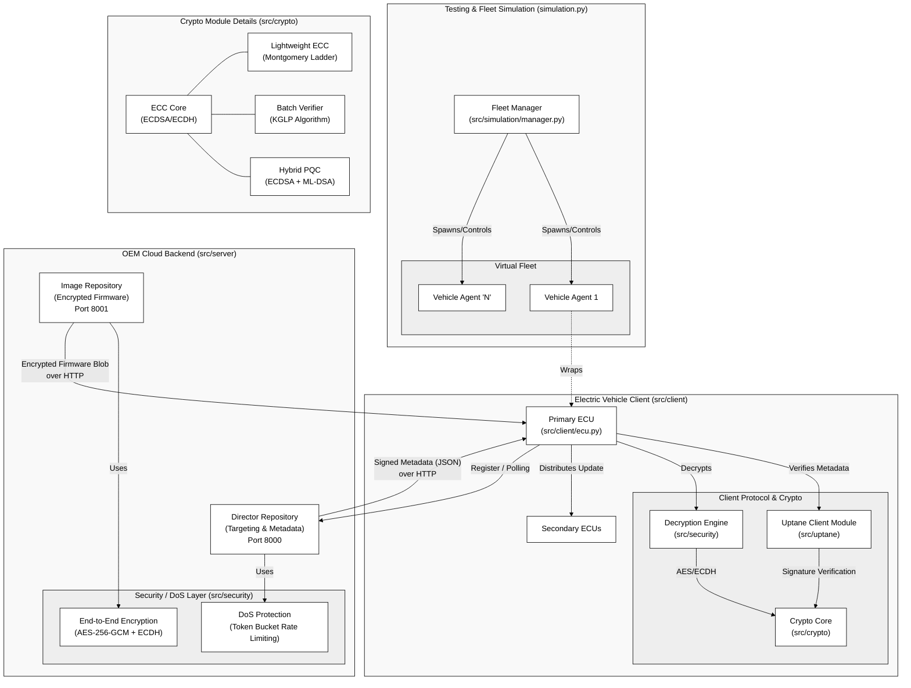

# SecureEV-OTA Absolute Architecture Diagram

Based on the exact structure and implementation of the `SecureEV-OTA` project, the following diagram maps the comprehensive architecture, detailing the deployment model, module interactions, and core components of both the OEM Cloud and the Electric Vehicle.

## Architecture Diagram

---

## Component Mapping Breakdown

### 1. OEM Cloud Backend (Server)
Stored in `src/server/`, this represents the OEM's update infrastructure. 
- **Director (`director.py`)**: Runs on port 8000. It manages vehicle registrations, provides public keys for trust bootstrapping, and generates tailored update metadata for specific vehicles.
- **Image Repository (`image_repo.py`)**: Runs on port 8001. It is the storage location for `E2E encrypted` firmware blobs securely uploaded by the OEM.
- **Security Layer (`src/security/`)**: Wraps backend interactions. Uses `dos_protection.py` to prevent DDoS on update requests via advanced Token Bucket rate limiting, and `e2e_encryption.py` to securely pack firmware using ECDH-derived AES-GCM algorithms.

### 2. Electric Vehicle Client
Stored in `src/client/`, representing the primary edge device (ECU) inside the actual vehicle.
- **Primary ECU (`ecu.py`)**: The main interface connecting to the OEM cloud. It coordinates the update lifecycle: Polling the Director, downloading firmware from the Image Repo, verifying Uptane-signed metadata, decrypting payloads, and installing.
- **Uptane Layer (`src/uptane/`)**: Handles the Uptane-standardized metadata formats for Root, Targets, and Snapshots, guaranteeing no malicious downgrades or mix-and-match attacks succeed.

### 3. Cryptographic Core
Stored in `src/crypto/`, this highly modular package is heavily referenced by both the Cloud and the Vehicle.
- **ECC Core (`ecc_core.py`)**: The P-256 standard foundation for ECDSA and ECDH.
- **Lightweight ECC (`lightweight_ecc.py`)**: Utilizes point compression and Montgomery Ladder to reduce the ECU memory footprint of cryptographic checks by 50%.
- **Batch Verification (`batch_verifier.py`)**: Optimizes Cloud-side verification of incoming fleet data using KGLP algorithm.
- **Hybrid PQC (`hybrid_pqc.py`)**: An absolute future-proofing mechanism using classical ECDSA + post-quantum algorithms (ML-DSA) to sign and verify.

### 4. Fleet Simulation
Stored in `simulation.py` and `src/simulation/`.
- **Fleet Manager (`manager.py`)**: Harnesses `asyncio` to spawn hundreds of localized instances of vehicle clients (`VehicleAgent`). Demonstrates mass-concurrency, resilience, and real-time Dashboard metrics. 
- **Vehicle Agents**: Wrappers that use actual instances of `PrimaryECU`, connecting loop-backed HTTP traffic securely to the Director and Image repositories on the local testing network.
