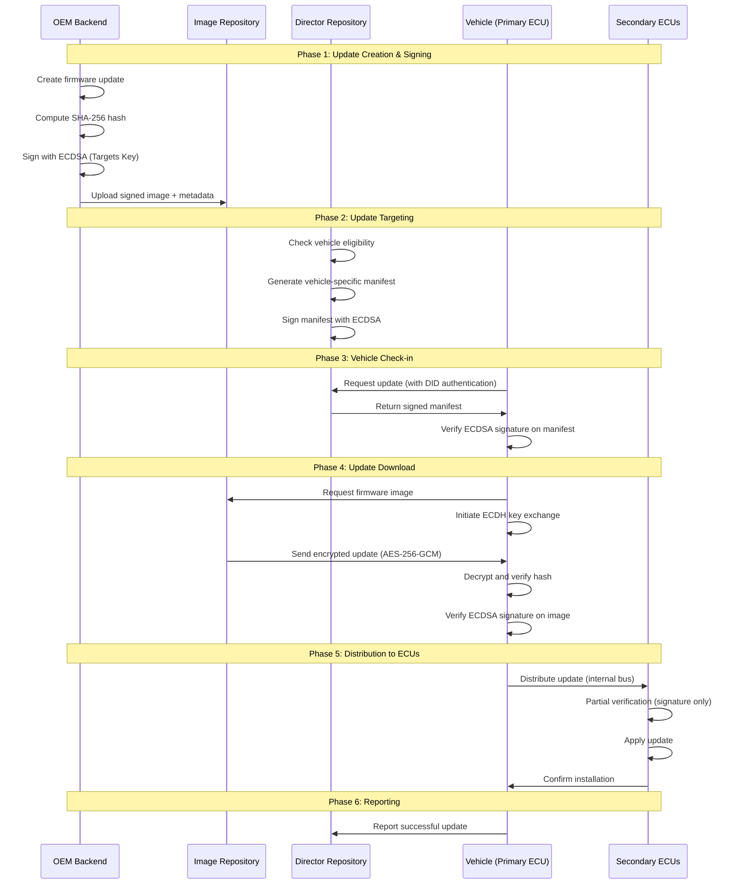

# Project Ideation: ECC-Secured OTA Update System for Electric Vehicles

## Project Title
**SecureEV-OTA: Elliptic Curve Cryptography-Based Secure Over-the-Air Update Framework for Electric Vehicles**

---

## 1. Executive Summary

### Vision
Develop a comprehensive, production-ready software framework that implements **Elliptic Curve Cryptography (ECC)** to secure **Over-the-Air (OTA) updates** for Electric Vehicles (EVs). The system will provide end-to-end security from update creation to vehicle deployment, ensuring authenticity, integrity, and confidentiality of all firmware and software updates.

### Key Innovation
A hybrid architecture combining:
- **Uptane-inspired** multi-repository security model
- **Decentralized Identifiers (DIDs)** for vehicle identity
- **ECC-based cryptography** (ECDSA + ECDH) for all security operations
- **Pure software implementation** ready for real-world deployment

---

## 2. Problem Statement

### Current Challenges in EV OTA Security

| Challenge | Impact | Our Solution |
|-----------|--------|--------------|
| Unauthorized updates | Vehicle hijacking, safety risks | ECDSA signature verification |
| Man-in-the-Middle attacks | Tampered firmware | End-to-end encryption (ECDH) |
| Identity spoofing | Fake vehicles receiving updates | DID-based identity system |
| Single point of failure | Complete system compromise | Multi-repository architecture |
| Key compromise | Widespread vulnerability | Key rotation & threshold signatures |
| Rollback attacks | Downgrade to vulnerable versions | Version verification & secure metadata |

---

## 3. System Architecture

### 3.1 High-Level Architecture

```
┌─────────────────────────────────────────────────────────────────────────────┐
│                        SecureEV-OTA Architecture                            │
├─────────────────────────────────────────────────────────────────────────────┤
│                                                                             │
│  ┌─────────────────────┐          ┌─────────────────────┐                   │
│  │   OEM Backend       │          │  Update Repository  │                   │
│  │   (Image Server)    │◄────────►│   (Director Server) │                   │
│  │                     │          │                     │                   │
│  │  • Firmware Storage │          │  • Vehicle Manifest │                   │
│  │  • ECDSA Signing    │          │  • Update Targeting │                   │
│  │  • Metadata Gen     │          │  • ECDSA Signing    │                   │
│  └──────────┬──────────┘          └──────────┬──────────┘                   │
│             │                                │                              │
│             └───────────────┬────────────────┘                              │
│                             │                                               │
│                     ┌───────▼───────┐                                       │
│                     │  API Gateway  │                                       │
│                     │  (TLS 1.3)    │                                       │
│                     └───────┬───────┘                                       │
│                             │                                               │
│              ┌──────────────┼──────────────┐                               │
│              │              │              │                               │
│       ┌──────▼──────┐ ┌─────▼─────┐ ┌─────▼─────┐                         │
│       │   EV #1     │ │   EV #2   │ │   EV #N   │                         │
│       │             │ │           │ │           │                         │
│       │ ┌─────────┐ │ │           │ │           │                         │
│       │ │Primary  │ │ │           │ │           │                         │
│       │ │ECU      │ │ │    ...    │ │    ...    │                         │
│       │ │(Full)   │ │ │           │ │           │                         │
│       │ └────┬────┘ │ │           │ │           │                         │
│       │      │      │ │           │ │           │                         │
│       │ ┌────▼────┐ │ │           │ │           │                         │
│       │ │Secondary│ │ │           │ │           │                         │
│       │ │ECUs     │ │ │           │ │           │                         │
│       │ │(Partial)│ │ │           │ │           │                         │
│       │ └─────────┘ │ │           │ │           │                         │
│       └─────────────┘ └───────────┘ └───────────┘                         │
│                                                                             │
└─────────────────────────────────────────────────────────────────────────────┘
```

### 3.2 Component Breakdown

#### Backend Components (Server-Side)

| Component | Description | ECC Usage |
|-----------|-------------|-----------|
| **Image Repository** | Stores firmware images and metadata | ECDSA signing (offline keys) |
| **Director Repository** | Manages per-vehicle update targeting | ECDSA signing (online keys) |
| **Key Management Service** | ECC key generation, storage, rotation | P-256/secp256k1 keys |
| **DID Registry** | Decentralized vehicle identity management | DID documents with ECC verification methods |
| **API Gateway** | Secure communication endpoint | TLS 1.3 with ECDHE |

#### Vehicle Components (Client-Side)

| Component | Description | ECC Usage |
|-----------|-------------|-----------|
| **Primary ECU Client** | Full verification, downloads updates | ECDSA verification, ECDH key exchange |
| **Secondary ECU Client** | Partial verification | ECDSA verification only |
| **Secure Storage** | Stores keys, certificates, metadata | Protected key storage |
| **Update Manager** | Orchestrates update process | Signature verification |

---

## 4. ECC Implementation Details

### 4.1 Cryptographic Algorithms

```python
# Core Algorithm Selection

ALGORITHMS = {
    "signature": {
        "algorithm": "ECDSA",
        "curve": "secp256r1",  # NIST P-256
        "hash": "SHA-256",
        "use_case": "Signing update packages and metadata"
    },
    "key_exchange": {
        "algorithm": "ECDH",
        "curve": "X25519",  # Curve25519
        "use_case": "Establishing session keys for encrypted transfer"
    },
    "symmetric_encryption": {
        "algorithm": "AES-256-GCM",
        "key_derivation": "HKDF-SHA256",
        "use_case": "Encrypting update payload"
    },
    "hashing": {
        "algorithm": "SHA-256",
        "use_case": "Integrity verification"
    }
}
```

### 4.2 Key Hierarchy

```
Root Signing Key (ECDSA P-256)
├── Targets Key (ECDSA P-256)
│   └── Signs firmware images
├── Snapshot Key (ECDSA P-256)
│   └── Signs repository state
├── Timestamp Key (ECDSA P-256)
│   └── Signs freshness metadata
└── Vehicle Keys (per vehicle)
    ├── Vehicle Identity Key (DID)
    └── Session Keys (ECDH-derived)
```

### 4.3 Signature Scheme

```python
from cryptography.hazmat.primitives import hashes
from cryptography.hazmat.primitives.asymmetric import ec
from cryptography.hazmat.backends import default_backend

class ECDSASigner:
    """ECDSA signing for OTA updates."""
    
    def __init__(self, curve=ec.SECP256R1()):
        self.curve = curve
        self.private_key = None
        self.public_key = None
    
    def generate_keypair(self):
        """Generate ECDSA key pair."""
        self.private_key = ec.generate_private_key(
            self.curve,
            default_backend()
        )
        self.public_key = self.private_key.public_key()
        return self.private_key, self.public_key
    
    def sign(self, data: bytes) -> bytes:
        """Sign data using ECDSA."""
        signature = self.private_key.sign(
            data,
            ec.ECDSA(hashes.SHA256())
        )
        return signature
    
    def verify(self, public_key, signature: bytes, data: bytes) -> bool:
        """Verify ECDSA signature."""
        try:
            public_key.verify(
                signature,
                data,
                ec.ECDSA(hashes.SHA256())
            )
            return True
        except Exception:
            return False
```

---

## 5. Update Protocol Flow

### 5.1 Complete Update Workflow



### 5.2 Protocol Messages

```python
# Message Structures

class UpdateManifest:
    """Vehicle-specific update manifest."""
    schema = {
        "version": "1.0",
        "vehicle_did": "did:secureev:abc123",
        "timestamp": "2026-01-18T12:00:00Z",
        "targets": [
            {
                "ecu_id": "primary_mcu",
                "firmware_version": "2.1.5",
                "image_hash": "sha256:abc...",
                "image_size": 1048576,
                "download_url": "https://updates.secureev.com/fw/primary_2.1.5"
            }
        ],
        "signature": {
            "algorithm": "ecdsa-p256-sha256",
            "value": "base64_signature...",
            "keyid": "director-key-001"
        }
    }

class FirmwarePackage:
    """Signed firmware package."""
    schema = {
        "metadata": {
            "name": "primary_mcu_firmware",
            "version": "2.1.5",
            "target_ecu": "primary_mcu",
            "min_hardware_version": "1.0",
            "created_at": "2026-01-18T10:00:00Z"
        },
        "image": {
            "hash": "sha256:abc123...",
            "size": 1048576,
            "encrypted": True,
            "encryption_scheme": "aes-256-gcm"
        },
        "signature": {
            "algorithm": "ecdsa-p256-sha256",
            "value": "base64_signature...",
            "keyid": "targets-key-001"
        }
    }
```

---

## 6. Security Features

### 6.1 Attack Mitigation

| Attack Vector | Mitigation | ECC Component |
|---------------|------------|---------------|
| **Arbitrary Updates** | All updates must be signed | ECDSA verification |
| **Rollback Attacks** | Version numbers in signed metadata | Signed timestamps |
| **Freeze Attacks** | Timestamp expiration | ECDSA-signed freshness |
| **Mix-and-Match** | Snapshot of all current versions | Signed snapshot metadata |
| **Key Compromise** | Key rotation, threshold signatures | Multiple ECDSA keys |
| **Eavesdropping** | Encrypted transfer | ECDH + AES-256-GCM |
| **Identity Spoofing** | DID-based authentication | DID with ECC verification |

### 6.2 Compliance Mapping

| Requirement | UNECE R155/R156 | ISO 21434 | Our Implementation |
|-------------|-----------------|-----------|-------------------|
| Secure boot | ✅ | ✅ | ECDSA signature chain |
| Update authenticity | ✅ | ✅ | ECDSA signatures |
| Update integrity | ✅ | ✅ | SHA-256 + ECDSA |
| Confidentiality | ✅ | ✅ | ECDH + AES-256-GCM |
| Key management | ✅ | ✅ | Hierarchical ECC keys |
| Audit trail | ✅ | ✅ | Signed logs |

---

## 7. Project Modules

### 7.1 Core Modules

```
SecureEV-OTA/
├── crypto/                    # ECC Cryptographic Core
│   ├── __init__.py
│   ├── ecdsa_signer.py       # ECDSA signature operations
│   ├── ecdh_exchange.py      # ECDH key exchange
│   ├── key_manager.py        # Key generation, storage, rotation
│   └── utils.py              # Hash functions, encoding
│
├── identity/                  # DID Identity System
│   ├── __init__.py
│   ├── did_document.py       # DID document management
│   ├── did_resolver.py       # DID resolution
│   └── vehicle_identity.py   # Vehicle identity operations
│
├── server/                    # Backend Components
│   ├── __init__.py
│   ├── image_repository.py   # Image storage and signing
│   ├── director.py           # Update targeting
│   ├── api_gateway.py        # REST API endpoints
│   └── database.py           # Metadata storage
│
├── client/                    # Vehicle Components
│   ├── __init__.py
│   ├── primary_ecu.py        # Full verification client
│   ├── secondary_ecu.py      # Partial verification client
│   ├── update_manager.py     # Update orchestration
│   └── secure_storage.py     # Key and metadata storage
│
├── protocol/                  # Protocol Implementation
│   ├── __init__.py
│   ├── messages.py           # Protocol message definitions
│   ├── metadata.py           # Metadata generation/parsing
│   └── verification.py       # Signature verification logic
│
├── simulation/                # Testing & Simulation
│   ├── __init__.py
│   ├── vehicle_simulator.py  # Simulated vehicle fleet
│   ├── attack_simulator.py   # Security testing
│   └── network_simulator.py  # Network conditions
│
├── web/                       # Web Dashboard
│   ├── templates/
│   ├── static/
│   └── dashboard.py          # Flask/FastAPI dashboard
│
├── tests/                     # Unit & Integration Tests
│   ├── test_crypto.py
│   ├── test_protocol.py
│   └── test_e2e.py
│
├── config/                    # Configuration
│   ├── settings.py
│   └── logging.py
│
├── requirements.txt
├── setup.py
└── README.md
```

### 7.2 Module Descriptions

| Module | Purpose | Key Features |
|--------|---------|--------------|
| **crypto/** | Core ECC operations | ECDSA, ECDH, key management |
| **identity/** | Vehicle identity | DID creation, verification |
| **server/** | Backend services | Repository, director, API |
| **client/** | Vehicle software | Update download, verification |
| **protocol/** | Message handling | Encoding, parsing, validation |
| **simulation/** | Testing framework | Fleet simulation, attack testing |
| **web/** | Admin dashboard | Monitoring, management UI |

---

## 8. Technology Stack

### 8.1 Core Technologies

| Category | Technology | Purpose |
|----------|------------|---------|
| **Language** | Python 3.10+ | Primary development |
| **Cryptography** | `cryptography` library | ECC operations |
| **Web Framework** | FastAPI | Backend API |
| **Database** | SQLite/PostgreSQL | Metadata storage |
| **Messaging** | MQTT (paho-mqtt) | Update notifications |
| **Testing** | pytest | Unit/integration tests |
| **Documentation** | Sphinx + MkDocs | API documentation |

### 8.2 Dependencies

```txt
# requirements.txt

# Core Cryptography
cryptography>=41.0.0
ecdsa>=0.18.0
pynacl>=1.5.0

# Web Framework
fastapi>=0.100.0
uvicorn>=0.23.0
python-multipart>=0.0.6

# Database
sqlalchemy>=2.0.0
alembic>=1.11.0

# Messaging
paho-mqtt>=1.6.0

# Security
python-jose[cryptography]>=3.3.0
passlib>=1.7.4

# Utilities
pydantic>=2.0.0
httpx>=0.24.0
python-dateutil>=2.8.0

# Testing
pytest>=7.4.0
pytest-asyncio>=0.21.0
hypothesis>=6.80.0

# Development
black>=23.7.0
mypy>=1.4.0
ruff>=0.0.280
```

---

## 9. Development Roadmap

### Phase 1: Foundation (Week 1-2)
- [ ] Set up project structure
- [ ] Implement core ECC cryptographic module
- [ ] Create ECDSA signing/verification
- [ ] Implement ECDH key exchange
- [ ] Unit tests for crypto module

### Phase 2: Protocol (Week 3-4)
- [ ] Define message formats
- [ ] Implement metadata generation
- [ ] Create signature verification chain
- [ ] Build protocol handlers
- [ ] Protocol unit tests

### Phase 3: Backend (Week 5-6)
- [ ] Image repository service
- [ ] Director service
- [ ] API gateway
- [ ] Database integration
- [ ] Integration tests

### Phase 4: Client (Week 7-8)
- [ ] Primary ECU client
- [ ] Secondary ECU client
- [ ] Update manager
- [ ] Secure storage
- [ ] Client tests

### Phase 5: Simulation (Week 9-10)
- [ ] Vehicle fleet simulator
- [ ] Attack scenarios
- [ ] Performance testing
- [ ] Security audit

### Phase 6: Dashboard & Polish (Week 11-12)
- [ ] Web dashboard
- [ ] Documentation
- [ ] Demo scenarios
- [ ] Final testing

---

## 10. Success Metrics

| Metric | Target | Measurement |
|--------|--------|-------------|
| **Signature Verification Time** | < 50ms | Per-update verification |
| **Key Generation Time** | < 100ms | P-256 key pair |
| **End-to-End Update Time** | < 5s (1MB firmware) | Full update cycle |
| **Attack Detection Rate** | 100% | Known attack patterns |
| **False Positive Rate** | 0% | Legitimate update rejection |
| **Concurrent Vehicles** | 1000+ | Simulation capacity |

---

## 11. Future Extensions

### Hardware Integration (Phase 2)
- Integration with real ECU hardware
- Hardware Security Module (HSM) support
- CAN bus communication
- Real vehicle testing

### Advanced Features (Phase 3)
- Post-quantum cryptography migration
- Blockchain audit trail
- AI-based anomaly detection
- Multi-OEM federation

---

## 12. Conclusion

This project provides a comprehensive, standards-compliant framework for securing OTA updates in electric vehicles using ECC. The pure software implementation allows for:

1. **Immediate Development** - No hardware dependencies
2. **Easy Testing** - Simulation framework included
3. **Scalable Architecture** - Designed for fleet management
4. **Future-Ready** - Extensible for hardware integration
5. **Compliant** - Aligns with UNECE R155/R156

The combination of Uptane architecture, ECC cryptography, and DID-based identity provides a robust, industry-aligned solution for the next generation of EV security.

---

## Author
Generated by SecureEV-OTA Project Ideation System
Date: January 18, 2026
